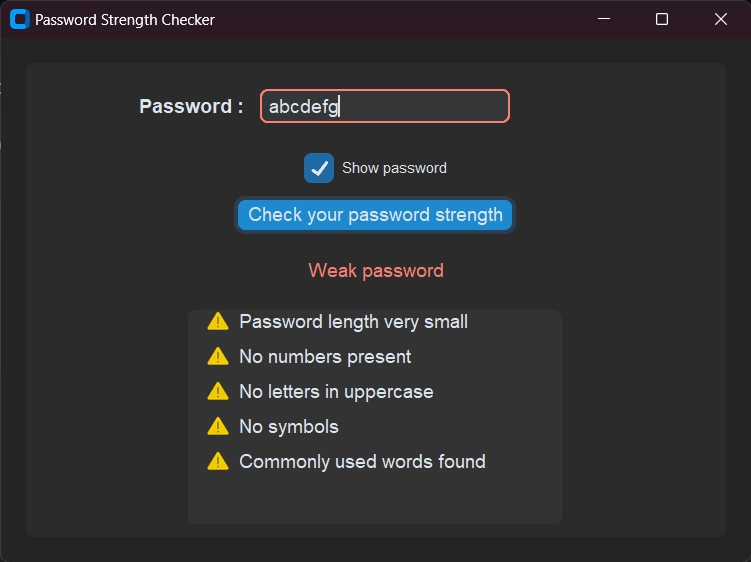

# Password Strength Checker

A Python-based password strength checker utilizing the custom Tkinter library ensures enhanced security by evaluating and providing suggestions to improve password strength.
It offers visibility toggling when typing, alerts about commonly hacked passwords, and even notifications if key pieces such as a combination of letters, numbers and symbols are missing.



## Features 
- Assess strength of your password with color coded meter
    - 🟥 Weak = Red color 
    - 🟧 Moderate = Orange color
    - 🟦 Strong = SkyBlue color
    - 🟩 Very strong = Green color
- Displays reasons when password is not strong enough instantly
- Displays ideas to improve password strength
- Toggle your password visibility when typing and checking
- Alerts user to change the password when the password has commonly used passwords worldwide as it is easy to hack
- Alerts user when essential parts of a strong password such as mix of letters, number,symbol is not used.
- Warns users if their password contains repeated characters in sequence.
- Works offline without Internet connection

## Tips to create very strong password 
- Ensure your password has a mix of alphabets, numbers and symbols randomly.
- Length of password determines how long it takes to hack it, so use password having more than 14 or 16 characters.
- Do not use commonly used word or numbers such as "password", "admin", "123", "111", "xyz", "abcd" as it is easy to guess.
- Avoid using your name, date of birth, year of birth, and your personal details as password.
- Avoid repeating same characters consecutively.
- Avoid using famous terms as password.
- Avoid using same password everywhere.

## Getting Started

To get started with this project, follow these steps:

1. Clone the repository:

```bash

git clone https://github.com/Sarthaklad1034/Password-Strength-Checker.git
```

2. Open the project in your preferred code editor.

3. Launch the `main.py` file using running and debugging.

4. Feel free to modify the code and customize the page according to your preferences. You can update the content, change the colors, or add new features.

## Contributing

Contributions to this project are welcome. If you find any issues or have suggestions for improvements, please open an issue or submit a pull request.

## License

This project is licensed under the [MIT License](LICENSE). Feel free to use the code for personal or commercial purposes.

## Contact

If you have any questions, suggestions, or feedback, you can reach out to the project maintainer:

- Linkedin : [sarthak-lad](https://linkedin.com/in/sarthak-lad)
- Email: [sarthaklad1034@gmail.com](mailto:sarthaklad1034@gmail.com)

---

Enjoy exploring the code and creating your own weather broadcast website!
